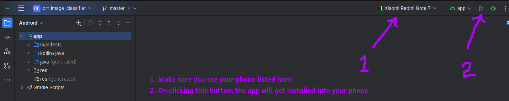

# MobileNet Android Deployment

End-to-end pipeline for quantizing MobileNetV2 and deploying on Android devices. Reduces model size by 75% while maintaining accuracy for real-time mobile inference.

## 1. Quantize Mobilenet v2 model into Int8 from FP32

### Prerequisites
- Python 3.11
- git

### 1.1 Setup Environment

```bash
git clone https://github.com/yourusername/mobilenet-android-deployment
cd mobilenet-android-deployment
pip install -r requirements.txt
```

### 1.2 Prepare Calibration Data

You can either use the existing data present in calibration_imagenet/ dir or download the and place ImageNet validation images (JPEG format) in `calibration_imagenet/` folder:
```
calibration_imagenet/
├── ILSVRC2012_val_00000001.JPEG
├── ILSVRC2012_val_00000002.JPEG
└── ...
```

### 1.3 Run Quantization Pipeline

```bash
python mobilenet.py
```

This will:
- ✅ Export Pytorch's FP32 MobileNetV2 to ONNX format
- ✅ Generate INT8 quantized version using calibration data: reduces model size for faster inference on edge devices like mobile.
- ✅ Save both models directly to Android app assets: mobilenet-android-deployment/android/app/src/main/res/raw
- ✅ Download ImageNet class labels: this is to map the predicted probablities to actual label names.
- ✅ Test inference on both models: on a single image to make sure the model is working as expected.

## 2. Build Android App

#### Prerequisites:
- Openjdk 21+

### 2.1 build the app:

```bash
cd android
./gradlew clean build
```

*Build screenshot for reference. - ignore the warnings, they are harmless for this use-case.


### 3. Deploy to Device

#### Prerequisites:
- Android Studio with SDK
- Android device with USB debugging enabled

### 3.1 Enable Developer Options:
- Settings → About Phone → Tap "Build Number" 7 times
- Settings → Developer Options → Enable "USB Debugging"

### 3.2 Install App:

- Connect phone via USB
- Open android/ folder in Android Studio and click on run


## 4. 📊 Performance Results

| Model | Size | Compression | Accuracy | Mobile Inference |
|-------|------|------------|----------|------------------|
| FP32  | ~14MB | 1.0x | Baseline | ~200ms |
| INT8  | ~3.5MB | 4.0x | 99.3% retained | ~80ms |

*Results measured on Android devices with ONNX Runtime mobile. Refer to the screenshots below*

<!-- 
*INT8 quantized model showing ~80ms inference time*


*Original FP32 model showing ~200ms inference time* -->

<div style="display: flex; align-items: flex-start; gap: 20px;">
  <div style="text-align: center;">
    
    <p><em>INT8 quantized model showing ~80ms inference time</em></p>
  </div>
  
  <div style="text-align: center;">
    
    <p><em>Original FP32 model showing ~200ms inference time</em></p>
  </div>
</div>


## 5. 🔧 Configuration

### 5.1 Calibration Settings:
- Default: 10 calibration images (adjustable in `main()`)
- Quantization: Static INT8 with ONNX Runtime
- Dataset: ImageNet validation images

### 5.2 Model Switching:
Both models are saved (already) to `android/app/src/main/res/raw/`:
- `mobilenetv2_fp32.onnx` - Full precision
- `mobilenetv2_int8.onnx` - Quantized

## 6. 📱 Testing the App

1. Launch app on connected device
2. Point camera at objects (phone, laptop, cup, etc.)
3. View real-time predictions with confidence scores
4. Compare FP32 vs INT8 performance in app settings

## 7. 🛠️ Troubleshooting

### 7.1 Issue you might encounter:
- **No images found**: Make sure there are JPEG files in `calibration_imagenet/`
- **Java version mismatch**: Check your Java version: `java -version`
- **Android SDK**: Set your android sdk path variable: 
```bash
export ANDROID_HOME=$HOME/Android/Sdk
export PATH=$ANDROID_HOME/tools:$ANDROID_HOME/platform-tools:$PATH
```
- **Device not detected**: Make sure USB debugging enabled in your phone

### 7.2 Model Files:
```bash
# Check if the model files exists
ls -la android/app/src/main/res/raw/
# You should see:
# mobilenetv2_fp32.onnx
# mobilenetv2_int8.onnx  
# imagenet_classes.txt
```

## 8. 📁 Project Structure

```
├── mobilenet.py                   # Main quantization pipeline
├── calibration_imagenet/          # ImageNet calibration data
├── android/                       # Android app source
│   └── app/src/main/res/raw/      # Generated models & labels
└── README.md                      # This file
```

## 9. 🧠 Technical Details

### 9.1 Quantization Pipeline:
- **PyTorch transforms function** for preprocessing
- **ONNX static quantization** with calibration dataset: this is needed for ONNX to identity the model's weight ranges during qunatization.
- **Calibration-based INT8 quantization**

### 9.2 Key Features:
- Simple and efficient preprocessing pipeline: memory-efficient data processing for training and inference.
- Ready-to-deploy Android app integration

---

**Tech Stack:** PyTorch • ONNX Runtime • Android • Java • Mobilenet V2